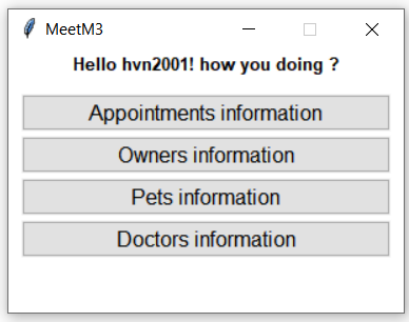
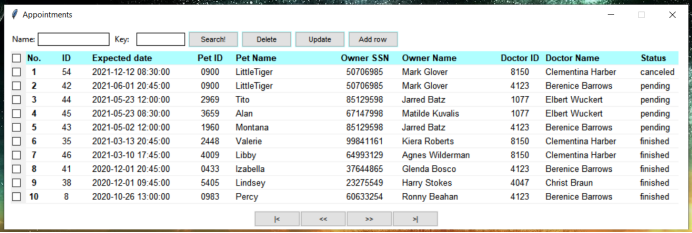
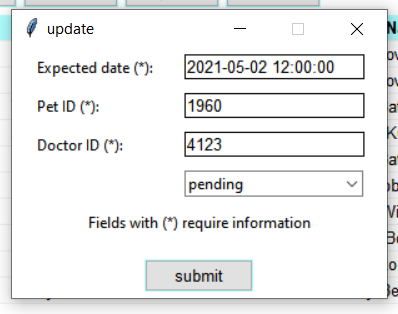

# MeetM3

## Table of contents
- [MeetM3](#MeetM3)
    - [Description](#Description)
    - [Prerequisites](#Prerequisites)
    - [How to comple and run](#How-to-comple-and-run)
    - [Screen shot](#Screen-shot)
    - [Credit](#Credit)

## Description
- Database class project for bonus score
- Medical examination scheduling software for veterinary clinic. 
- This is a database application, helping veterinary clinic to organize appointments with customers and patients (pet). 
- The application stores information/data about customers, who are pet owners and their pets, and schedules appointments between doctors and customers.

## Prerequisites
- Python 3.7 (or Python 3.6)
- Tkinter
- Pandas
- mysql-connector-python

### Installing Prerequisite
- Install [Python 3.7](https://www.python.org/downloads/release/python-379/)
- Download Pip for python: https://pip.pypa.io/en/stable/installing/
- Download [MySQL server](https://dev.mysql.com/downloads/mysql/) or you can use [XAMPP](https://dev.mysql.com/downloads/mysql/) instead. Google for more information about MySQL server setup.
- Use pip to install Tkinter, Pandas and mysql-connector-python:
    > pip install Tkinter  
    > pip install pandas  
    > pip install mysql-connector-python  

## How to comple and run
- First, clone/download this repository for source code.

### Loading database
- Open MySQL Shell or MySQL command line client, login and load database from [schema.sql](./Database/schema.sql):
    > source "\<userpath\>\MeetM3\Database\schema.sql"
- I had created some sample data in the database.

### Changing port, user and password
- In the file [database.py](./Database/database.py), change the port, user, password field at line 7-9 to your MySQL Server port, user, password or you can set environment variable:
    * Set new value name DBPort and the value is your port.
    * Set new value name DBP and the value is your password.

### Compile and run
- After every thing is set up, compile the [main.py](./main.py) and run it with python.

## Screen shot

## Credit
- Made by [***@Darthveloper21***](https://github.com/Darthveloper21).
- This project is licensed under the [**MIT License**](https://choosealicense.com/licenses/mit).
